# NutriTrack

NutriTrack to aplikacja internetowa stworzona z myślą o osobach dbających o zdrowie i dietę. Umożliwia użytkownikom śledzenie spożycia kalorii, białka, tłuszczy i węglowodanów oraz wizualizację tych danych na intuicyjnych wykresach. Aplikacja wspiera zarówno użytkowników indywidualnych, jak i administratorów, którzy mogą zarządzać danymi innych użytkowników.

## Funkcje

- **Rejestracja i logowanie** – Każdy użytkownik ma możliwość założenia konta i logowania do swojego spersonalizowanego dashboardu.
- **Śledzenie diety** – Użytkownicy mogą dodawać dane dotyczące codziennego spożycia kalorii, białka, tłuszczy i węglowodanów.
- **Wizualizacja danych** – Aplikacja generuje wykresy, które pomagają użytkownikom monitorować ich postępy w czasie.
- **Bezpieczeństwo sesji** – Automatyczne wylogowywanie po 20 minutach braku aktywności zapewnia bezpieczeństwo danych użytkowników.
- **Tryb administratora** – Specjalny widok umożliwiający administrowanie użytkownikami i zarządzanie danymi.

## Technologie użyte w projekcie

- **Backend:**
    - **PHP** – Główny język programowania używany do logiki aplikacji.
    - **PostgresSQL** – Baza danych przechowująca dane użytkowników i ich codzienne raporty dotyczące diety.

- **Frontend:**
    - **HTML, CSS, JavaScript** – Do budowy interfejsu użytkownika.
    - **Chart.js** – Biblioteka do generowania interaktywnych wykresów, które pomagają użytkownikom wizualizować dane o ich diecie.

- **Zarządzanie danymi:**
    - **Ciasteczka (Cookies)** – Wykorzystywane do przechowywania danych sesji użytkowników, takich jak ich identyfikator, imię oraz czas logowania.

## Przykłady funkcjonalności

1. **Personalizowany dashboard:**
   Po zalogowaniu użytkownicy widzą swój spersonalizowany widok, gdzie mogą śledzić codzienne spożycie składników odżywczych oraz przeglądać dane w formie wykresów.

2. **Tryb admina:**
   Administratorzy mogą przeglądać dane wszystkich użytkowników oraz zarządzać ich kontami, co czyni NutriTrack idealnym narzędziem dla dietetyków czy trenerów personalnych.

3. **Wykresy i analiza:**
   Wizualizacje danych oparte na wykresach ułatwiają użytkownikom analizę ich nawyków żywieniowych i postępów.

## Przeznaczenie

NutriTrack jest idealnym rozwiązaniem dla osób, które chcą w sposób zorganizowany zarządzać swoją dietą i monitorować postępy. Aplikacja może być również wykorzystywana przez profesjonalistów, takich jak dietetycy i trenerzy personalni, do zarządzania danymi swoich klientów.

## W planach rozwoju

- **Dodatkowe wykresy** – np. analiza tygodniowa i miesięczna.
- **Integracja z urządzeniami do pomiaru aktywności fizycznej**.
- **Powiadomienia i przypomnienia** o zapisaniu danych diety.
- **API dla integracji z aplikacjami mobilnymi**.

---

NutriTrack – Twoje zdrowie w Twoich rękach!

Diagram ERD bazy danych:

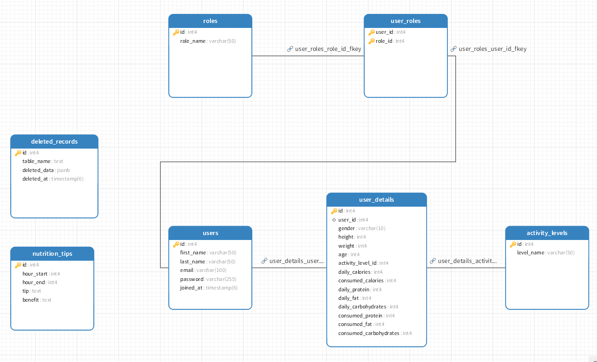

Widoki z działania aplikacji

### 1. Ekran logowania (login)
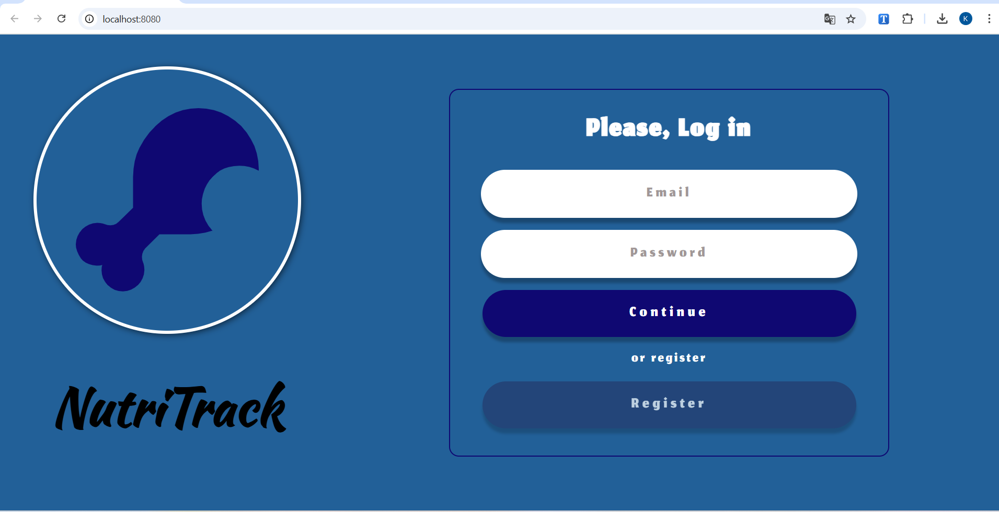

### 2. Ekran rejestracji (register)
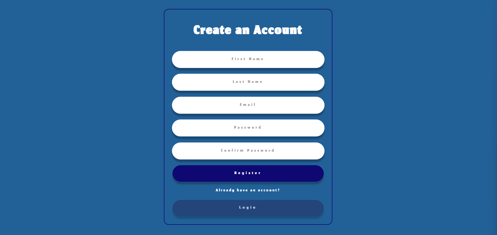

### 3. Dashboard (dashboard)
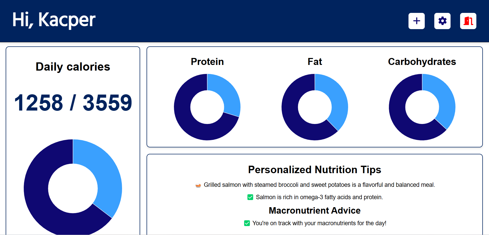

### 4. Szczegóły użytkownika (user_details)
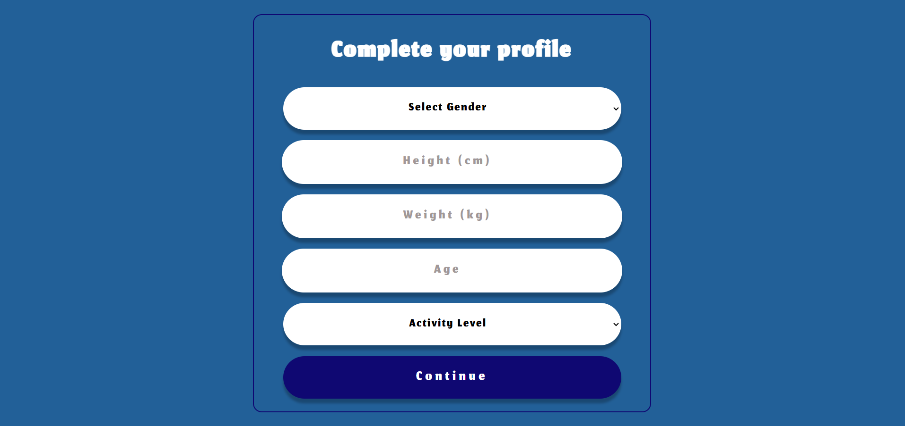

### 5. Profil użytkownika (my_profile)
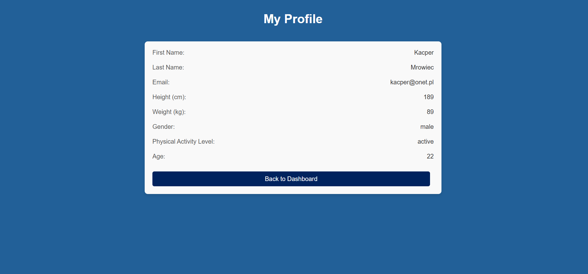

### 6. Dodawanie posiłku (add_meal)
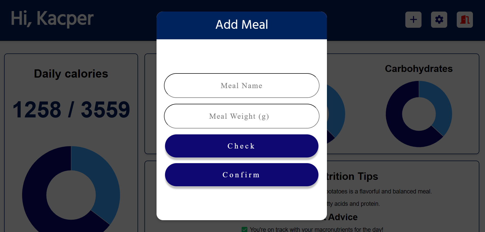

### 7. Widok mobilny rejestracji (register_mobile)
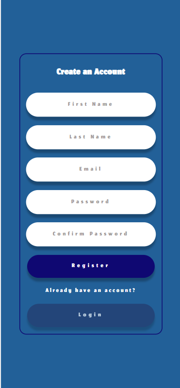

### 8. Widok mobilny logowania (login_mobile)
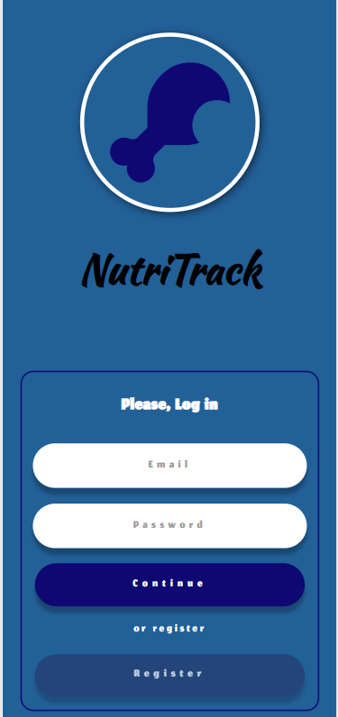

### 9. Widok mobilny dashboard (dashboard_mobile)
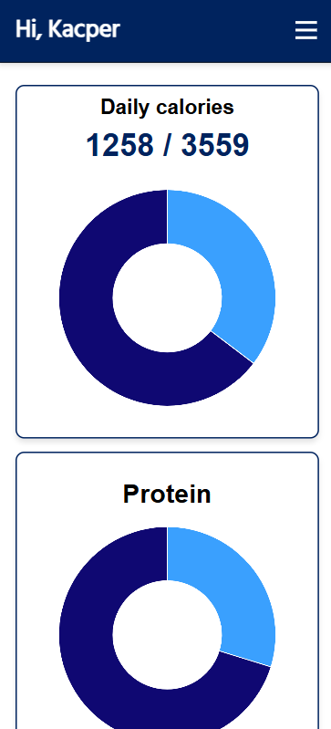

### 10. Widok mobilny szczegółów użytkownika (user_details_mobile)
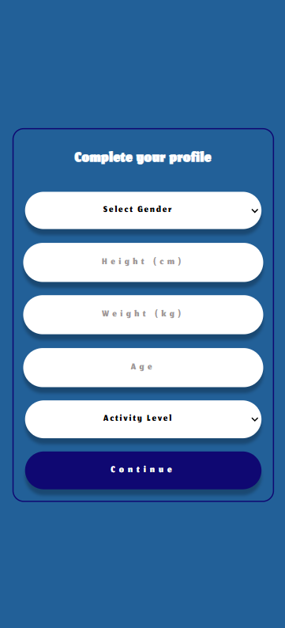

### 11. Widok mobilny profilu (my_profile_mobile)
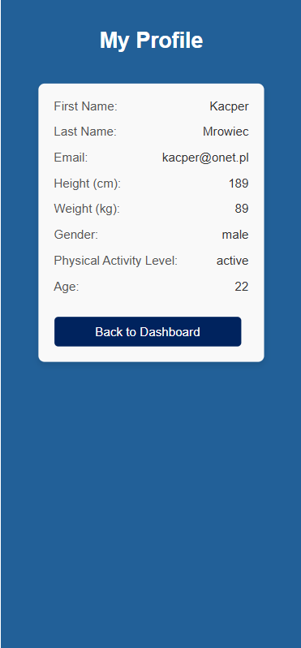

### 12. Widok mobilny dodawania posiłku (add_meal_mobile)
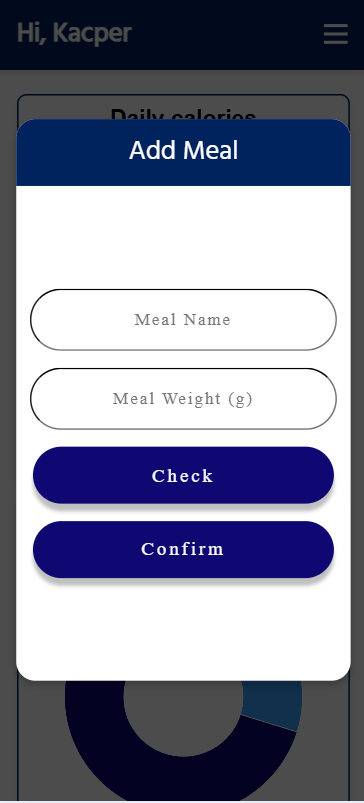

